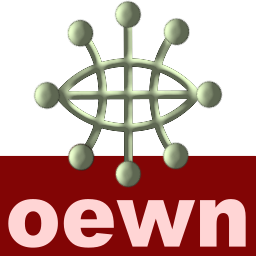

# Open English Wordnet and WordNet 31 in JSON form

This provides zipped JSON file of the Open English Wordnet in **JSON** format.
It is available in 3 formats:

  * **oewn hierarchical** format: follows roughly the YAML release with senses **embedded** in lexical entries
  * **data flat** format: the senses are not embedded in lexical entries. This is a **tabular** design with lexes, synsets and senses having their own entities, senses are understood are a relation between lexes and synsets (having their own properties). Loading is much faster.
  * **model** format: this is a serialization of the in-memory model, with Kotlin serialization performing the serialization. The fastest persistence.

Download [oewn base 2026](https://x-englishwordnet.github.io/json/oewn-2026.json.zip).

Download [oewn plus 2026](https://x-englishwordnet.github.io/json/oewn-plus-2026.json.zip).

Download [data base 2026](https://x-englishwordnet.github.io/json/oewn-data-2026.json.zip).

Download [data plus 2026](https://x-englishwordnet.github.io/json/oewn-plus-data-2026.json.zip).

Download [model base 2026](https://x-englishwordnet.github.io/json/oewn-model-2026.json.zip).

Download [model plus 2026](https://x-englishwordnet.github.io/json/oewn-plus-model-2026.json.zip).

Download [wn31.json.zip](https://x-englishwordnet.github.io/json/wn31.json.zip).

These are the serialization (performed by Kotlin serialization libraries) outputs of WN31 and OEWN models.
See [oewntk/model](https://github.com/oewntk/model)